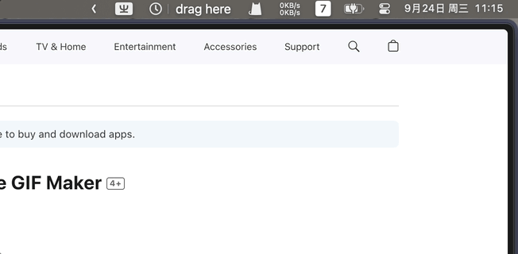

# Timer App for Mac OS

Timer **User-Agent App** written in Swift for Mac OS.

Using Gesture Recognizer to set the time, User Notification on finished Timer.

1. Display the remaining time in text format.
2. Show the current task to minimize distractions.
3. Automatically sync records to Calendar.app for time tracking.

---

## Ressources & Inspirations:

- [User Notification Image](https://github.com/lukakerr/Swift-NSUserNotificationPrivate)
- [Gestimer](http://maddin.io/gestimer/)
